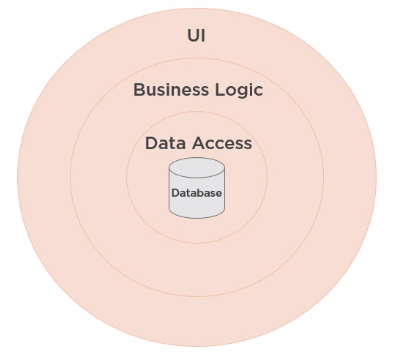
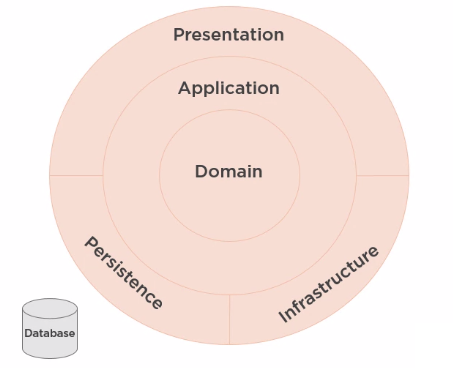
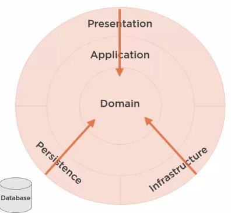
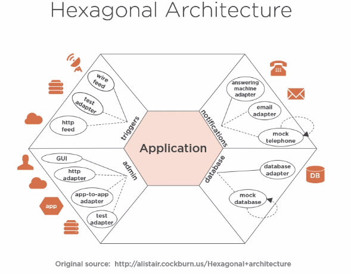
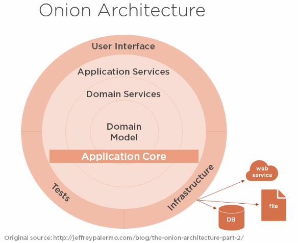
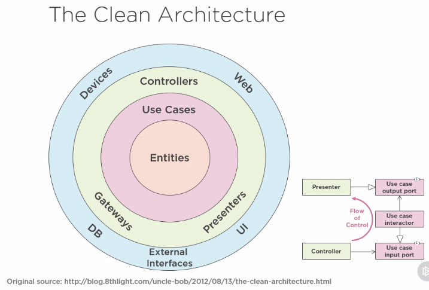
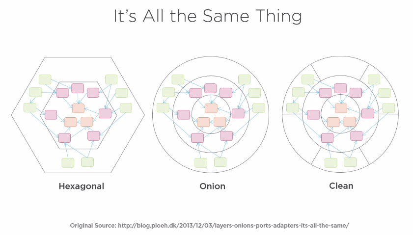

# Domain Centric Architecture

Classic Three-layer Database-centric Architecture

Architecture centers around the database.

Domain-centric Architecture

Architecture centers around the domain, database is viewed as a implementation detail.

*"The first concern of the architect is to make sure that the house is usable, its not to ensure that the house is made of brick"* - Uncle Bob

Different architectures have different views on what is essential vs what is a detail.

The essentials are the things that support the primary need of the users.

- Domain Model is essential
- Use cases is essential
- Presentation is a detail
    Razor, JSP, javascript
- Persistance is a detail
    We could use MySQL, PostgreSQL etc...

In Domain-centric Architecture all dependency points inwards towards the domain model of the system.

### Domain Centric Architecture types

They are all essential the same, they pu the domain object at the center, wrap it in a application layer that embeds the use cases, adapts the application to the implementation details and all dependencies should point inwards to the domain.

### Why yse Domain-centric Architecture

Pros
 - Focus on domain
 - Less coupling between domain model and implementation details
 - Allows for DDD

Cons
 - Change is difficult, architects and developers might be unfamiliar
 - Requires more thought
 - Initial higher cost (typically pays for it self as features grow)

