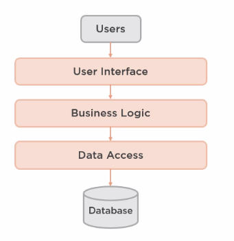

# Introduction module

Clean Architecture purpose

 - Philosophy of architectural essentialism
 - Set of patterns, practice, and principles
 - Alternative to traditional architecture(3 layer, db centric)

Adaptable to change over time. 
 
Focus on
 - Enterprise applications
 - Agile architecture

## What is software architecture

- High-level
- Structure
- Layers
- Components
- Relationships

#### Levels of abstraction

### Messy vs Clean Architecture

#### Messy

- Accidental complexity
- Incoherent, parts does not seem to fit
- Rigid, architecture resists change and is hard to evolve
- Brittle, a change in one part of the system breaks something in another
- Untestable, the architecture fights testing
- Unmaintainable

#### Clean

- Only as complex as is necessary, not accidentally complex
- Understandable, its possible to reason about the architecture as a whole
- Flexible, easy to adapt the architecture to meet changing requirements
- Emergent, the architecture evolves during the lifetime of the project
- Testable, the architecture makes testing easier, not harder
- Maintainable

Clean Architecture is architecture design fo the inhabitants of the architecure, not for the architect or the machine.

Inhabitants
 - User of the system
 - Developers building the system
 - Developers maintaining the system

 ### Why invest in Clean Architecture?
 - Cost/benefit
 - Minimize cost
 - Maximize the value
 Maximize ROI

#### Clean Architecture maximizes ROI by:
- Focus on the essential for the system inhabitants
    Embed use cases and mental models of the users into the system architecture and code.
- Build only what is necessary, when it is necessary
    Build only the architecture that solves the immediate need of the use, order needs after business value, avoid accidental complexity, unnecessary features and feature creep
- Optimize for maintainability
    Maintaining is main cost for a system

### Decisions

Context is king in the land of architecture. Every answerer is depended on different  constraints and goals. Every architectural decision involves a tradeoff. Often a tradeoff between two different types of complexity. Complexity we don't want vs complexity we also don't want, but is slightly better. The job of a software architect is to make tradeoffs that minimizes const and maximizes ROI.

Many Clean Architecture patterns and practices might not result in higher ROI for a given problem in a given context. The job of a software architect is to use the right tools for their project and context.

